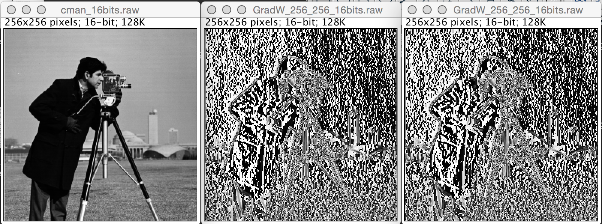

# aConvolution-improved

# Idea:

For zero-padded case we can iterate only through the neighbours that are inside the image and skip the other neighbours. The idea is to make the neighbours vector consist of _only_ neighbours inside the image, thus improving the perfomance.

# Results

The left image is the original image that is used for testing, the center image is the output of improved implementation and the right one is the output of initial implementation.



It seems the right and the center images are the same, however let's produce some output to be sure. For that purpose debug
output was added to `aConvolution::make` and `aMyConvolution::make` in order to compare the output of `tconvolution` and `mytconvolution`.

The result files can be found under `screen_and_prove` directory of this repo. They consist of all the points we iterate and all the neighbours we calculate. The files are quite big, so here is their diff:

```bash
➜ vlad:aConvolution-improved$ diff result.txt ../aConvolution/result.txt
1304590c1304590
< Done ...
---
> Done ...
```

Actually they differ only in one trailing space after `Done ...`, so, there is everything correct in the implementation.

# Run (unix)

You can run the project this way if you have atk sources installed under `$ATK_SOURCES`:

1. `$ cd $ATK_SOURCES/atk/atk/Examples/dip`
2. `$ git clone git@github.com:vladshablinsky/aConvolution-improved.git` inside `atk/atk/Examples/dip`
3. `$ cd aConvolution-improved`
4. `$ cmake CMakeLists.txt`
5. `$ make`
6. `./run.sh`


# Notes.

Some changes might be applied to original library in order to achieve better compatibility: 

```diff
diff --git a/atk/include/aGrid.h b/atk/include/aGrid.h
index 0978e08..d599111 100755
--- a/atk/include/aGrid.h
+++ b/atk/include/aGrid.h
@@ -48,6 +48,7 @@ class aGrid {
   //! Get an address of the i-th point. Should be called after calculateAddresses().
   virtual long getAddress(int i)=0; 
   virtual void print()=0;
+  virtual void release()=0;
 }; // end class aBaseGrid definition
 
 /** \class aGrid4
@@ -72,6 +73,10 @@ class aGrid4: public aGrid {
     m_addresses.clear();
   };
 
+  virtual void release() {
+    delete this;
+  }
+
   //! Precalulate neighbourhoods of the point (x,y)
   virtual void calculateNeighbours(const intPOINT &P);
   //! Calculate adresses of the neighbours point P(addr) in ( dim.x x dim.y x dim.z ) matrix.
diff --git a/atk/src/dip/aConvolution.cxx b/atk/src/dip/aConvolution.cxx
index 78c6d7e..d201ea0 100755
--- a/atk/src/dip/aConvolution.cxx
+++ b/atk/src/dip/aConvolution.cxx
@@ -123,7 +123,7 @@ void aConvolution<T,U>::make(aImage<T> &img1, aImage<T> &img2, aImage<T> &out) {
   } // end for k
 
   // Clean memory
-  delete pGrid;
+  pGrid->release();
 
 }//end aConvolution<T,U>::makeConvolution() 
 
```
